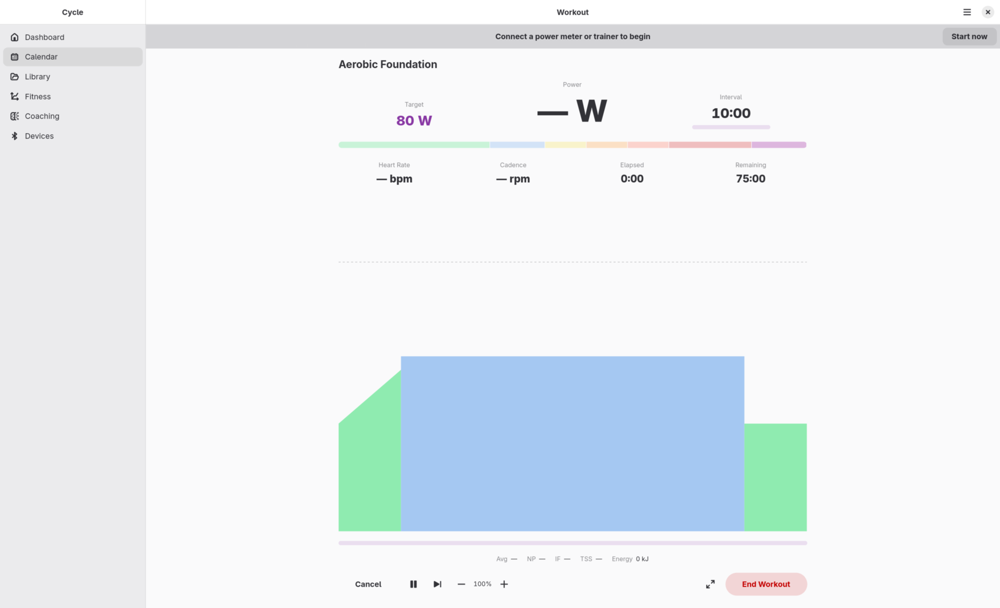
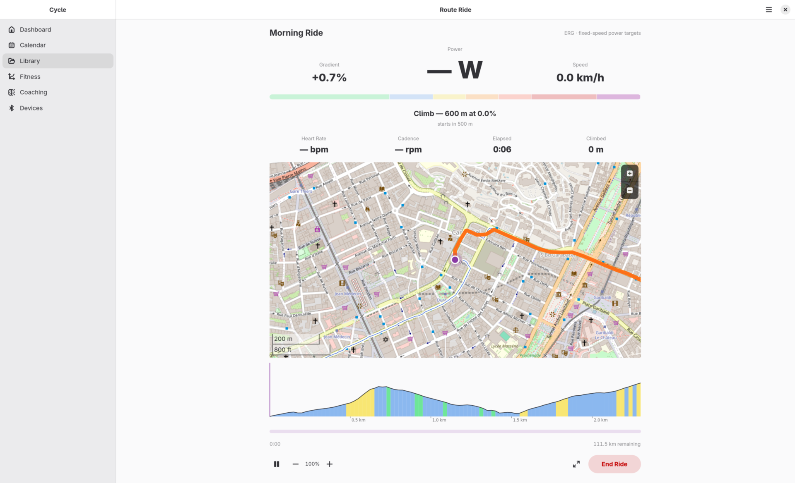
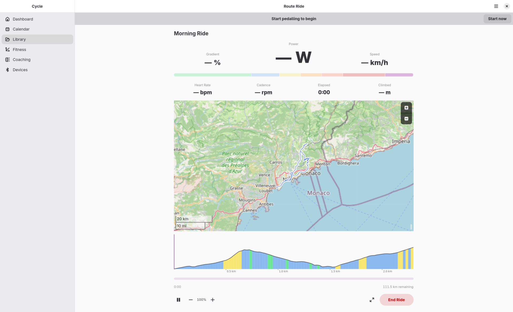
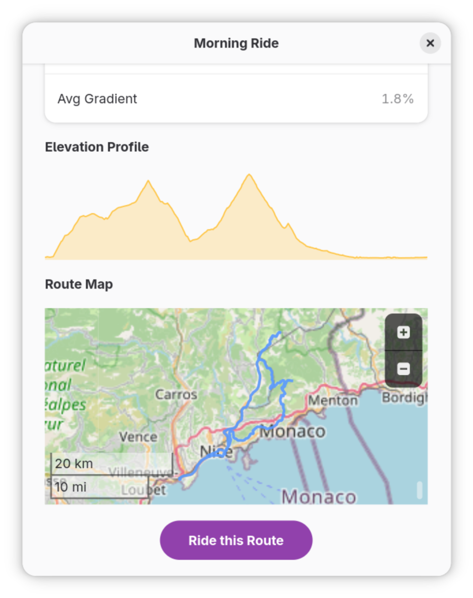
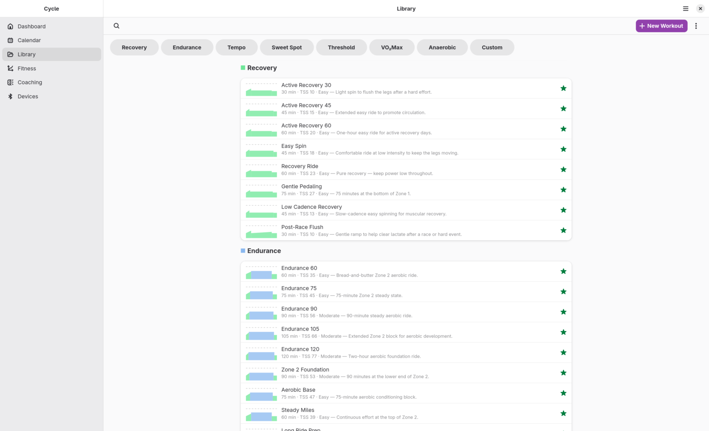
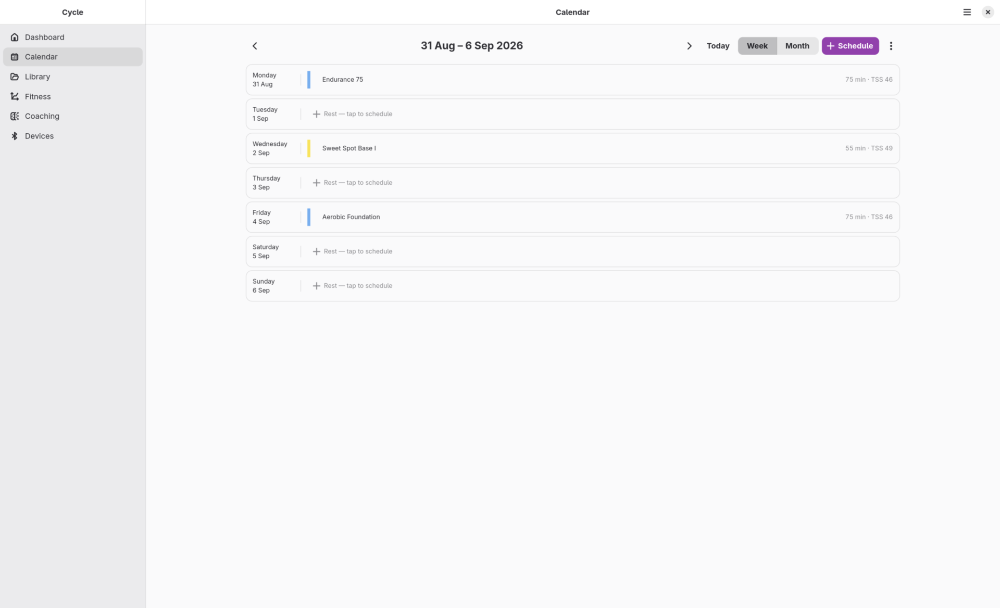
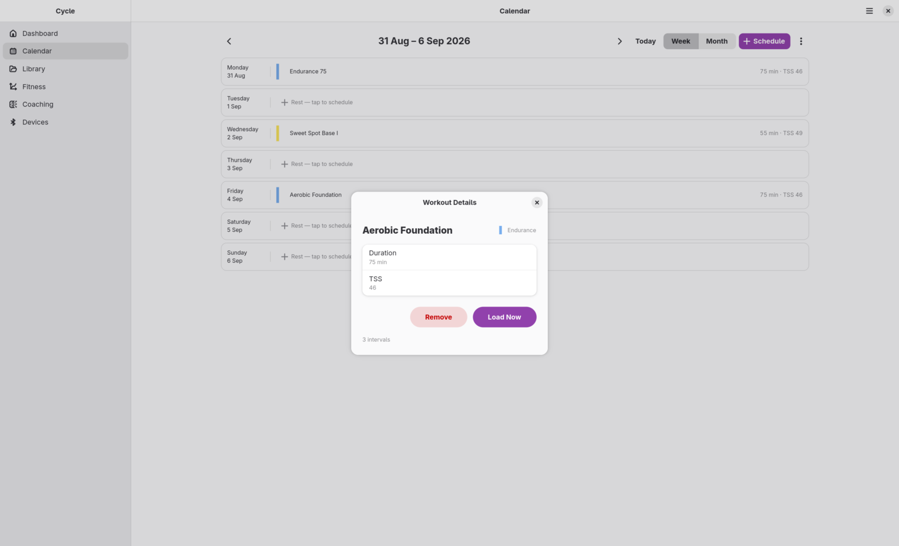
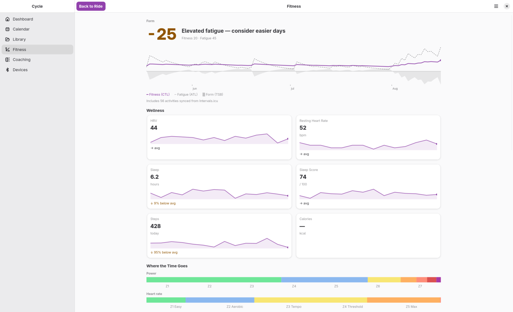
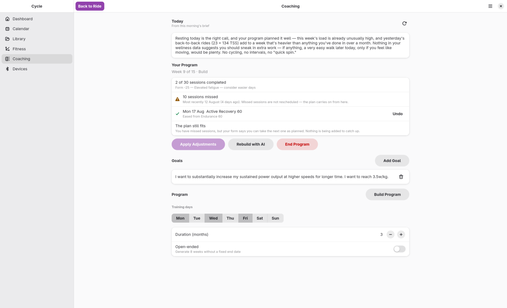
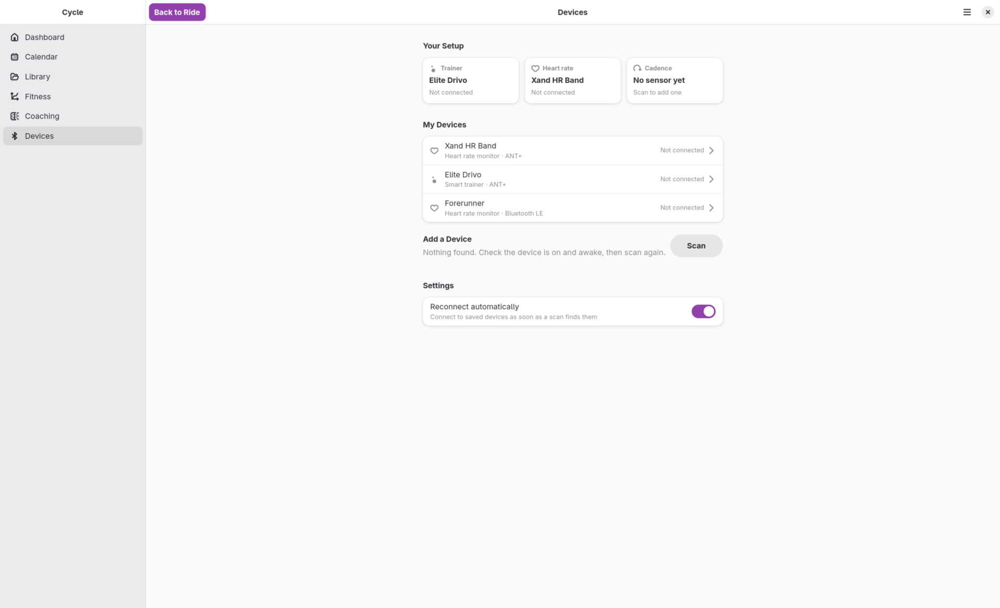

# Cycle

Cycle is a native GNOME application for indoor cycling training, built in Rust with GTK4 and libadwaita. It connects to smart trainers and sensors over Bluetooth LE and ANT+, executes structured workouts with automatic resistance control (ERG), records sessions, and integrates with Intervals.icu and the Anthropic Claude API for training analysis and AI-assisted coaching.

The application targets GNOME desktop environments and is distributed as a Flatpak.

---

## Screenshots

<table>
  <tr>
    <td width="50%" valign="top">
      <b>Workout player</b> — a structured workout loaded and ready: target power, the live power, cadence and heart-rate row, and the colour-coded workout graph.  
      
    </td>
    <td width="50%" valign="top">
      <b>Route ride</b> — a GPX course underway, with live gradient, speed, the next climb called out, and the map following the rider.  
      
    </td>
  </tr>
  <tr>
    <td width="50%" valign="top">
      <b>Route overview</b> — the whole course on the map with the look-ahead elevation chart beneath it.  
      
    </td>
    <td width="50%" valign="top">
      <b>Route preview</b> — elevation profile, average gradient and route map before committing to the ride.  
      
    </td>
  </tr>
  <tr>
    <td width="50%" valign="top">
      <b>Workout library</b> — structured workouts grouped by training category, each with duration, TSS and a shape preview.  
      
    </td>
    <td width="50%" valign="top">
      <b>Training calendar</b> — the week view, showing scheduled sessions with their planned duration and TSS.  
      
    </td>
  </tr>
  <tr>
    <td width="50%" valign="top">
      <b>Scheduled workout</b> — the detail dialog for a calendar entry, from which the workout can be loaded or removed.  
      
    </td>
    <td width="50%" valign="top">
      <b>Fitness</b> — CTL, ATL and TSB over time, wellness synced from Intervals.icu, and time spent in each power and heart-rate zone.  
      
    </td>
  </tr>
  <tr>
    <td width="50%" valign="top">
      <b>Coaching</b> — the training program with its adjustments, the day's brief, and the athlete's stated goals.  
      
    </td>
    <td width="50%" valign="top">
      <b>Devices</b> — saved trainers and sensors across BLE and ANT+, with automatic reconnection.  
      
    </td>
  </tr>
</table>

---

## Features

### Device connectivity

Cycle communicates with BLE devices using standard GATT profiles:

- **Smart trainers** — Fitness Machine Service (FTMS). ERG mode for structured workouts (the app sends a target power and the trainer adjusts resistance automatically) and SIM mode for route rides (the app sends the road gradient and the trainer sets resistance to match).
- **Power meters** — Cycling Power Service (CPS). Read-only; power data is recorded but the meter cannot be commanded.
- **Heart rate monitors** — Heart Rate Service (HRS). Supports both 8-bit and 16-bit HR measurement formats.
- **Cadence sensors** — Cycling Speed and Cadence Service (CSC), crank revolution data.

Trainers that expose no usable BLE interface are supported over **ANT+**: with a USB ANT+ stick, Cycle drives FE-C trainers with full ERG and SIM control plus power and speed readings.

Devices paired in a previous session are remembered and reconnected automatically on the next launch.

### Workout player

Structured workouts are executed segment by segment. Each segment specifies a target power as a percentage of the athlete's FTP. Ramp segments interpolate linearly between two power values. During execution the player displays elapsed and remaining time, target power in watts, live power, cadence, and heart rate from connected devices, and a colour-coded workout graph with a position cursor.

Workouts can be paused and resumed. Ending a workout early saves the recorded portion as a complete session. At the end of a session the athlete is prompted to record a Rate of Perceived Exertion (RPE) on a 1–10 scale.

### Route rides (SIM mode)

GPX routes can be ridden in simulation mode: the trainer's resistance follows the route's gradient, and the rider's measured power is converted to a virtual speed through a road-cycling physics model — ease off on a climb and the climb takes longer. The route player shows live gradient, virtual speed, position on the elevation profile, and distance remaining. Without a controllable trainer, route rides fall back to ERG emulation: power targets computed from the gradient at a fixed assumed speed.

### Workout library

The library holds structured workouts across eight training categories: Recovery, Endurance, Tempo, Sweet Spot, Threshold, VO₂ Max, Anaerobic, and Custom. A built-in workout creator edits workouts segment by segment — steady blocks and ramps with FTP-percentage targets, reorderable by drag and drop — and existing workouts can be opened in the same editor. Workouts can also be imported from `.zwo` files (Zwift XML format) or `.erg` files, scheduled to a calendar date, or deleted. GPX files can be loaded to preview a route's elevation profile and ride it in the route player.

### Training calendar

A monthly calendar view shows scheduled workouts, completed sessions, and marked time-off periods. FIT files recorded on external devices can be imported directly from the calendar. Time off can be marked for individual dates or date ranges.

### Session history

All sessions are stored locally in SQLite. The history view shows duration, average power, normalised power, average cadence, average heart rate, power zone distribution, kilojoules, and Training Stress Score. A route map rendered from OpenStreetMap tiles is shown when GPS data is present in the source FIT file. Sessions can be deleted individually or uploaded to Intervals.icu as FIT files.

### Fitness metrics

The fitness page computes and displays:

- **CTL** (Chronic Training Load) — 42-day exponentially weighted average of daily TSS
- **ATL** (Acute Training Load) — 7-day exponentially weighted average of daily TSS
- **TSB** (Training Stress Balance) — CTL minus ATL
- Weekly TSS totals and power zone distribution across recent sessions

These metrics are derived from both locally recorded sessions and activities synced from Intervals.icu.

### Intervals.icu integration

Connecting an Intervals.icu account enables syncing activity history (training load, power, HR, cadence, distance), syncing wellness data (HRV, resting HR, sleep, steps, calories), uploading locally recorded sessions as FIT files, and importing structured workouts from the Intervals.icu workout library. Credentials are stored in the GNOME Secret Service keyring.

### AI coaching

Cycle integrates with the Anthropic Claude API to provide:

- **Morning briefing** — a daily readiness assessment based on current CTL, ATL, TSB, wellness data, scheduled workouts, and upcoming time off. The briefing concludes with a recommendation to proceed, modify the planned workout, or rest.
- **Workout recommendation** — suggests a workout from the local library given the athlete's current training load and defined goals.
- **Retrospective analysis** — a written review of the past week or month of training, incorporating session data and wellness trends.
- **Training program generation** — produces a multi-week training plan toward a stated goal, expressed as workout recommendations.

The Anthropic API key is stored in the GNOME Secret Service keyring.

---

## Target audience

Cycle is intended for cyclists who train indoors on a smart trainer and want a self-contained GNOME application for session execution and training load management. It is most useful to athletes who already use Intervals.icu to track training history and wellness, prefer a native Linux desktop application over a browser-based or proprietary platform, and want AI-assisted training guidance without sending personal data to a third-party coaching service.

The application assumes familiarity with power-based training concepts: FTP, TSS, CTL, ATL, and power zones.

---

## Requirements

- Linux with a GNOME desktop environment
- Bluetooth adapter supporting Bluetooth LE (4.0 or later)
- Optional: a USB ANT+ stick for ANT+ FE-C trainers
- BlueZ accessible via D-Bus (standard on Fedora, Ubuntu, Arch, and most common distributions)
- GNOME Secret Service daemon (gnome-keyring or equivalent) for credential storage
- Network access for Intervals.icu sync, AI features, and map tile rendering

---

## Current limitations

### Device connectivity

- **ANT+ covers FE-C trainers only.** ANT+ heart rate straps and cadence sensors are not supported; use their BLE mode instead. Running the ANT+ stick outside Flatpak may require a udev rule granting USB access.

### Simulation

- The SIM physics model is simplified: fixed air density, rolling resistance, and drag area, with no wind, drafting, or surface changes. Rider weight comes from the athlete profile.

### AI integration

- The Anthropic Claude API is the only supported AI provider. The API endpoint is hardcoded to `api.anthropic.com`. Despite a reference to OpenAI and compatible APIs in the setup wizard, only the Anthropic API is implemented.
- AI features require a paid Anthropic API account. There is no offline fallback.
- The AI has no write access to the workout schedule; recommendations are displayed as text and must be acted on manually.

### External platform integrations

- Intervals.icu is the only supported external training platform. There is no Strava, TrainingPeaks, Garmin Connect, or Wahoo integration.
- FIT files from Garmin or other devices must be transferred manually and imported via the calendar or history view.

### Platform

- Linux only. There are no macOS or Windows builds.
- Distributed as a Flatpak targeting the GNOME Platform runtime. Running outside a Flatpak environment requires manual dependency resolution.
- The application has not been tested on non-GNOME desktop environments (KDE, Sway, etc.).

### Data portability

- Session data is stored in a local SQLite database (`~/.var/app/io.github.rorynuijens.Cycle/data/cycle/cycle.db` in the Flatpak sandbox). There is no automatic backup or cloud sync of the local database.
- FIT export is available per session. There is no bulk export of the full session history.
